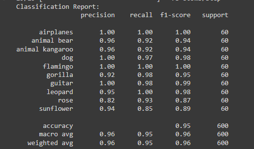
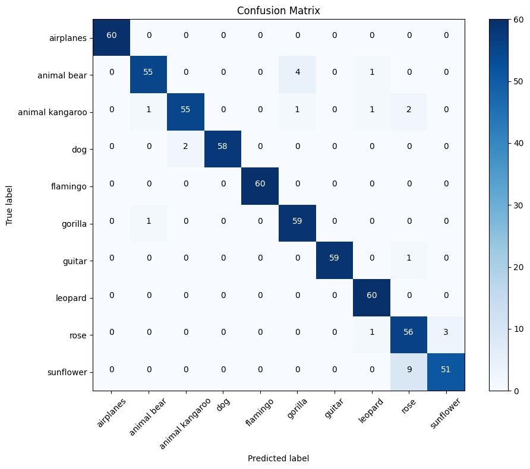

After updating the paths for the image directory, features, and model, run the command 
"streamlit run fmobile.py" to execute the script fmobile.py which is the streamlit frontend.

# DeepImageSearch
DeepImageSearch is an innovative image retrieval system leveraging Convolutional Neural Networks (CNNs) to enhance the efficiency and accuracy of image search processes. Utilizing the power of deep learning, DeepImageSearch transforms the way images are indexed and retrieved by extracting intricate features from images through convolutional layers
# Image Retrieval with MobileNetV2 CNN

This project utilizes the MobileNetV2 convolutional neural network architecture to train an image dataset for image retrieval. The comprehensive training process is documented in the "train.ipynb" notebook.

## Training Details

- **Model Architecture:** MobileNetV2 CNN
- **Dataset:**
- The model was trained on a diverse dataset comprising 10 distinct classes, each representing different types of images. The training process, documented in the "train.ipynb" notebook, covers the utilization of the MobileNetV2 convolutional neural network architecture and includes insightful details such as accuracy metrics, a classification report, and a confusion matrix for thorough evaluation.
  

## Insights and Evaluation

The training process provides detailed insights into the model's performance:

- **Accuracy:** [95%]

- 
- **Classification Report:**
- # Classification_Report
  
# Classification_Report

- **Confusion Matrix:**
- # confusion_Matrix

## Usage

To run the project, follow these steps:

1. Replace paths for the image directory, features, and model.
2. Execute the following command: streamlit run fmobile.py
